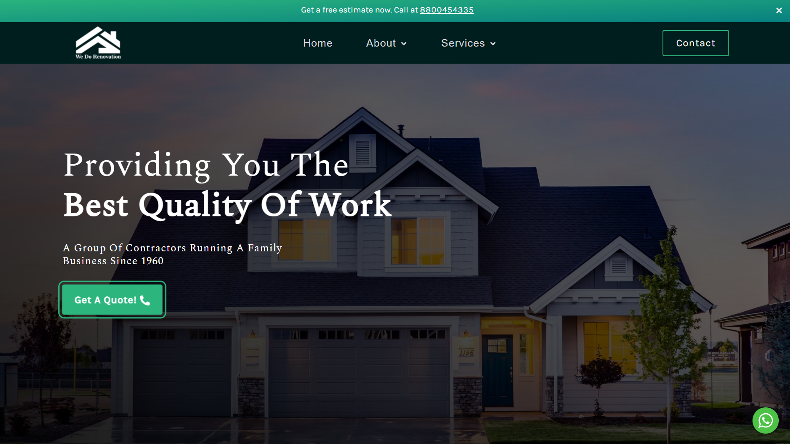

# wedorenovation.in

A website built with reactjs for a client who runs a local home renovation company. The design was created in Figma and it has features like google maps integration, programmatically created pages, several advanced components, etc. Apart from building the site, I am also responsible for creating the logo, optimizing the images, and writing the content for the website. In the end, I deployed it to Netlify with the client's custom domain and installed the SSL certificate.

## Preview

[www.wedorenovation.in - Live Site](https://wedorenovation.in)



## Stack

- Reactjs
- styled-components
- Context API

#### Resources

- [Figma - Website Design](https://www.figma.com/)
- [Pexels - Copyright Free Images](https://www.pexels.com/)
- [Undraw - SVG Illustrations](https://undraw.co/illustrations)

#### Packages

- [React Router Dom](https://www.npmjs.com/package/react-router-dom)
- [React Icons](https://www.npmjs.com/package/react-icons)
- [React Helmet](https://www.npmjs.com/package/react-helmet-async)

## How to Run?

To clone this project locally, run

```bash
  git clone https://github.com/yodkwtf/wedorenovation.in.git
```

To run this project locally, run

```bash
  npm install && npm start
```

## TO DO's

- [x] Update Jio number
- [x] Update location of office
- [x] Update map location
- [x] Update info section's para 2
- [x] Replace 2 skills from the skills section
- [] Replace reviews with google reviews
- [] Add a all reviews btn
- [] Change reviews to customer testimonials
- [] Update gallery images
- [] Referral and T&C section like home lane's
